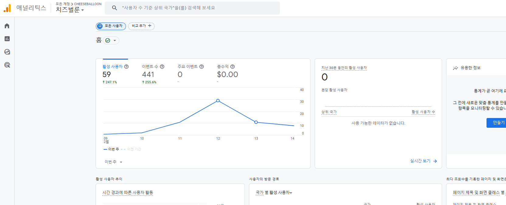

# CheeseBalloon


## 서비스 설명

#### 치즈벌룬은 2025.02.14로 서비스가 종료되었습니다.
##### 치즈벌룬은 비영리로 운영되었으며, 데이터의 법적 권리를 주장하지 않습니다.

### 📝 기획 의도

#### 치즈벌룬은 인터넷 방송 이용자가 증가하던 2024년의 상황(MAU: 23년 12월 기준 286만 명 → 24년 1월 기준 349만 명)에 맞춰,<br>이용자들이 플랫폼(SOOP, 치지직) 구분없이 한곳에서 원하는 실시간 방송 정보를 편리하게 확인할 수 있는 **통합 서비스를 제공하기 위해** 제작되었습니다.

#### 자금 사정상 개인 PC를 서버로 하여 제작되었습니다.<br>따라서, 현실적인 동접 트래픽 한계(500명), 지속 가능성(단순 CRUD 배제), 사용자 유치 가능성을 고려한 결과 해당 서비스가 기획되었습니다.

- pc 성능 : (CPU : I5-7400f, RAM: 16GB, HDD 2TB)
- 서버 구축 : Ubuntu, 포트포워딩, 가비아 DNS 설정

### 🎯 프로젝트 목표 및 성과

#### 치즈벌룬은 일 평균 15만 건, 월평균 1GB의 데이터를 수집하여, 실시간 방송 정보 및 방송인 통계 정보를 제공합니다.<br> 이에 인터넷 성능과 PC 성능을 고려하여, 높은 트래픽 획득보다 실질적으로 운영 가능한 범위의 서비스 제공을 목표로 하였습니다.

> **목표 이용자** : 주간 200명 이상 <br>
> **최대 이용자** : 주간 621명 (홍보 당시) <br>
> **최대 동접 이용자** : 200명 (홍보 당시) <br>
> **실제 평균 이용자** : 주간 40명 (홍보 제외 기준) <br>
```
@ 홍보는 인터넷 방송과 관련된 커뮤니티 사이트에서 익명으로 수행했습니다.
```
> **서비스 종료일 기준** : 59명<br>


- Locust 기준 성능 테스트(Redis 적용 전) 결과:
  - 100명: 평균 응답속도 60ms
  - 200명: 평균 응답속도 250ms
  - 300명: 평균 응답속도 450ms
  - 400명: 평균 응답속도 800ms (1초 이내, 성능 한계 도달)
  - Redis 적용 후 (Rollback으로 인해 기록 유실) : 60ms

```
기획 의도와는 달리 서비스는 사용자들의 니즈와 반대되었고, 이용자를 고정시킬 콘텐츠 부족으로 최소 목표치를 달성하지 못했습니다.
```

### 1️⃣ 프로젝트 개요

> 개발기간 : 2024.01.05 ~ 2024.05.16

> 운영기간 : 2024.06.18 ~ 2025.02.14


#### 팀원

| 팀원 | 역할 |
| --- | --- |
| 하상재 | 팀장, BE, CI/CD, Server, DB |
| 정경훈 | Crawling, BE, DB |
| 권혁근 | BE, DB |
| 이승민 | FE |
| 최창근 | FE, 디자인 |
| 배우찬 | FE |


### 2️⃣ 서비스 기능 소개

### 메인화면


### 공지사항


### 방송 랭킹
<br/>

### 방송인 통계


### 실시간 방송


### 검색 결과


### 로그인
<br/>

### 마이페이지


### 3️⃣ 기술 스택

### 백엔드 스택
    

### 프론트 스택
     

### 서버 스택
     

### 모니터링 스택
   

### 협업툴

   

### 4️⃣ 아키텍처


### 5️⃣ ERD
