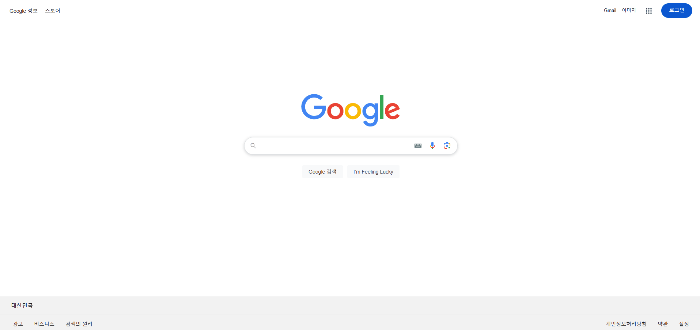
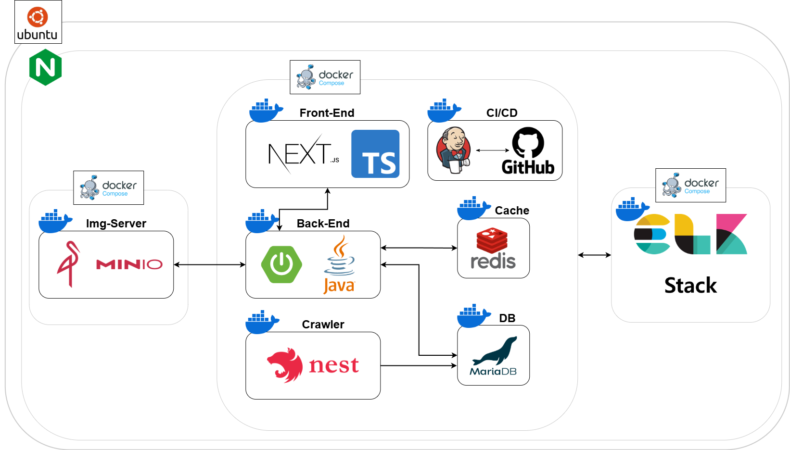
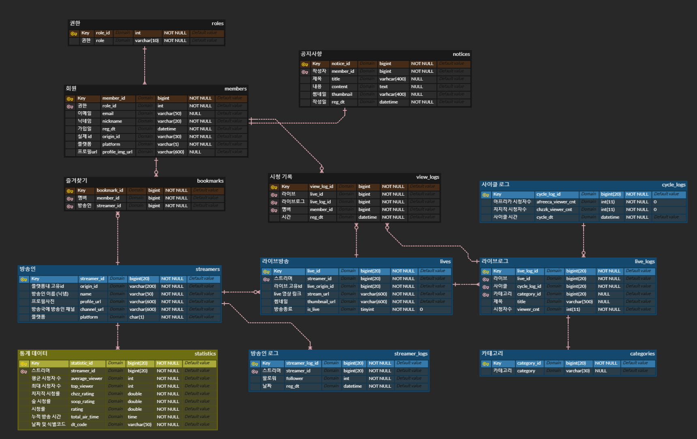

# CheeseBalloon

## 사이트 접속 (운영 기간 : 2024.06.18 ~ 2025.02.12)

### 치즈벌룬 접속하기 ( https://cheeseballoon.site )

<!--  -->

## 서비스 설명

치즈벌룬은 인터넷 방송의 팬분들이 더욱 방송을 즐길 수 있도록,   
인터넷 방송 플랫폼인 SOOP과 치지직의 방송의 통합 플랫폼을 제공하는 사이트입니다. 
저희 서비스를 통해 좋아하는 방송인의 방송 기록 / 카테고리 / 시청자 수 / 방송 기간 / 팔로워 수 등의 정보를 확인하세요! 

@@ 저희 사이트는 비영리로 운영하며 데이터의 법적 권리는 방송 플랫폼(SOOP/치지직)에 있습니다. 

### 1️⃣ 프로젝트 개요

<b>개발 기간</b>　:　2024.01.05 ~ 2024.05.16 

#### 팀원

| 팀원 | 역할 |
| --- | --- |
| 하상재 | 팀장, BE, CI/CD, Server, DB |
| 정경훈 | Crawling, BE, DB |
| 권혁근 | BE, DB |
| 이승민 | FE |
| 최창근 | FE, 디자인 |
| 배우찬 | FE |

### 2️⃣ 서비스 기능 소개

### 메인화면

### 공지사항

### 방송 랭킹
 

### 실시간 방송

### 검색 결과

### 로그인
 

### 마이페이지

### 3️⃣ 기술 스택

### 백엔드 스택

### 프론트 스택

### 서버 스택

### 모니터링 스택

### GIT

### 4️⃣ 아키텍처

### 5️⃣ ERD
